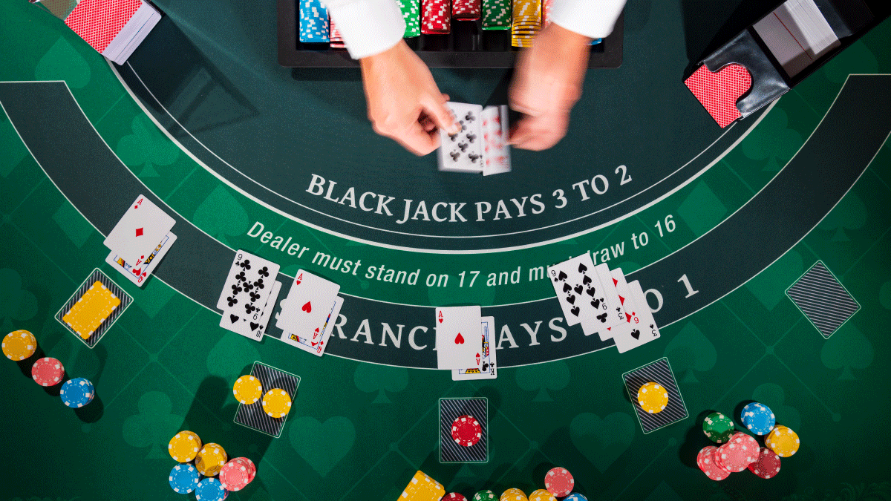
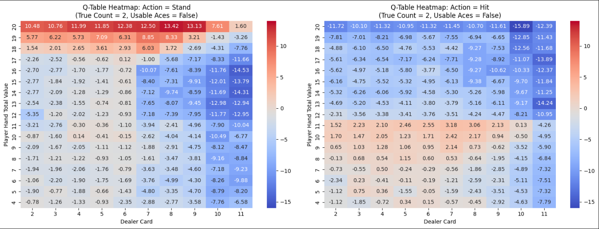
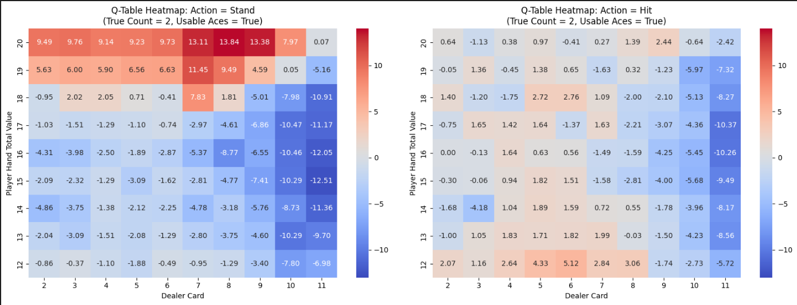
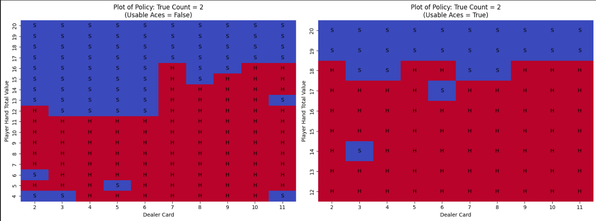
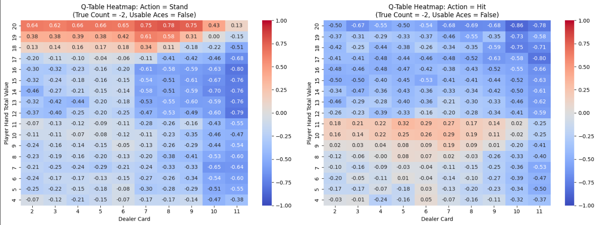
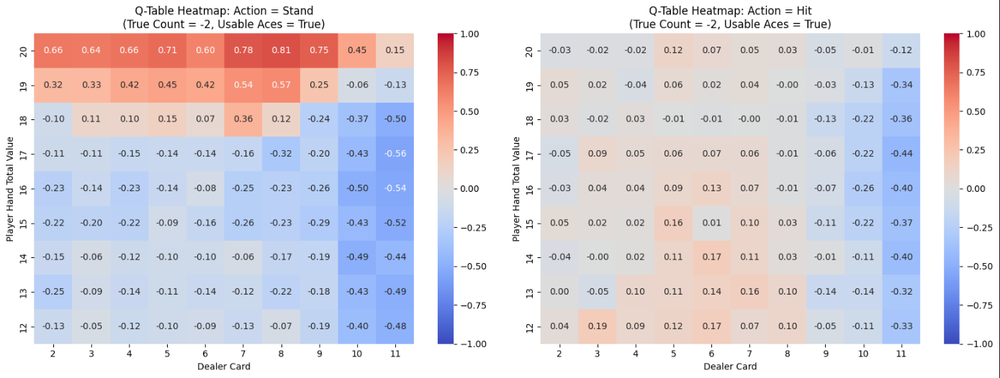
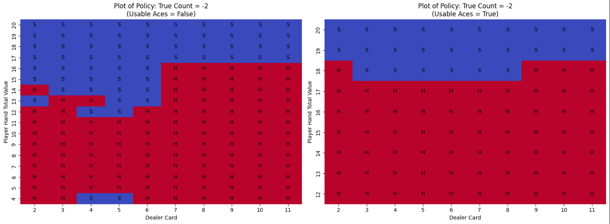

# Blackjack with Card Counting and Reinforcement Learning

## Overview

This repository contains a Python implementation of a Blackjack game with card counting using the Hi-Lo system. The game follows the standard Blackjack rules, with the player making a decision to either "hit" or "stand." The game also incorporates a simple reinforcement learning (RL) agent that decides the best action based on the current game state, which includes both the player's and dealer's hands as well as the true count. The agent adjusts its betting strategy according to the state.

The project contains:
1. **Blackjack Game Environment**: Simulates the game according to the defined rules.
2. **Reinforcement Learning Agent**: A basic RL agent trained to optimize its decisions based on the game state and true count.
3. **Card Counting**: Uses the Hi-Lo system to track the running and true counts to influence the player's betting and actions.
4. **Simulation and Evaluation**: The agent is evaluated through simulations to verify its performance.

## Goal

The goal of this project is to **train a reinforcement leanring model** that achieves a **positive reward when the True Count (TC) = 2**. By leveraging the Hi-Lo card counting system, the agent adjusts its strategy to maximize winnings under favorable deck conditions.  

## Table of Contents

1. [Game Rules](#game-rules)
2. [Card Counting](#card-counting)
3. [Reinforcement Learning](#reinforcement-learning)
4. [Comparison & Evaluation](#evaluation)
5. [Visualizations](#visualizations)
6. [Conclusion](#conclusion)

## Game Rules
The game is based on traditional Blackjack rules, with some adjustments for card counting and betting:
- **Card Values**: Number cards count as their face value, Jack, Queen, and King count as 10, and Aces can be counted as 1 or 11.
- **Blackjack**: A player total of 21 with the first two cards is a Blackjack. The player wins unless the dealer also has a Blackjack, in which case a tie occurs.
- **Dealer Behavior**: The dealer must draw cards if their hand value is a soft 17 (includes an Ace) or hard 16 or lower.
- **Hi-Lo Counting System**: Cards are counted as:
    - +1 for low cards (2, 3, 4, 5, 6)
    - 0 for neutral cards (7, 8, 9)
    - -1 for high cards (10, Jack, Queen, King, Ace)
- Bets: A large bet (20) is made when the true count is +2 or higher, and a small bet (1) is made otherwise.

## Card Counting
Card counting is implemented using the Hi-Lo system:
- Low cards (2-6) increase the running count by +1.
- Neutral cards (7-9) have no effect on the running count.
- High cards (10, Jack, Queen, King, Ace) decrease the running count by -1.
The running count is then divided by the number of remaining decks to calculate the true count. This value influences the agent’s betting and decision-making.

## Reinforcement Learning
The reinforcement learning agent is trained to make decisions (either "hit" or "stand") based on the current game state. The agent's decisions are influenced by:
- The total value of the player's hand.
- The total value of the dealer's hand.
- The true count, which indicates the remaining deck's favorability.
- Wether have usable Aces.
The agent is trained using Temporal Difference (e.g. Q-learning) and PPO algorithm to maximize the expected return based on its actions.

## Comparison & Evaluation
The performance of the **TD model** and **PPO model** through 10,000 games is summarized and compared below. While the **PPO model** is generally considered a more advanced method, the **Q-Learning model (TD with λ = 1)** achieved a higher reward in this case. This is likely because **Q-Learning's table-based approach efficiently captures the discrete game states** in Blackjack, allowing it to converge to an optimal policy more effectively than PPO, which relies on function approximation and may require more data for stable learning.

Additionally, both models performed better when **True Count (TC) = 2** compared to **TC = -2**, aligning with expectations. A **higher TC (TC = 2)** indicates that more **high-value cards (10s and Aces) remain in the deck**, increasing the likelihood of **stronger player hands and Blackjacks**, while **TC = -2** suggests a deck with more low-value cards, favoring the dealer. This explains why the models perform better in **favorable deck conditions (TC = 2)** by taking advantage of the increased probability of winning hands.

| Method    | True Count  | Win Rate (%) | Loss Rate (%) | Tie Rate (%) | Average Reward |
|-----------|-------------|--------------|---------------|--------------|----------------|
| TD        | 2           | 45.06        | 47.28         | 7.66         | 0.17           |
| TD        | -2          | 42.46        | 49.14         | 8.40         | -0.04          |
| PPO       | 2           | 43.04        | 48.51         | 8.45         | -1.09          |
| PPO       | -2          | 41.29        | 50.19         | 8.52         | -0.09          |

## Visualisation
The Q-Learning agent's behavior under different true count conditions is visualized to demonstrate how it adapts to favorable and unfavorable deck compositions.

For the case where true count is 2:

For the case where true count is -2:

## Conclusion
Mission accomplished! 🎉 We have successfully trained a **Q-Learning model** that **beats the odds** and **rakes in positive rewards** when true count is 2 over a large number of games. 🃏💰  

So, if you're ever in a Blackjack showdown, just remember—our AI has your back (but maybe don’t bet your life savings on it)! 😆  

